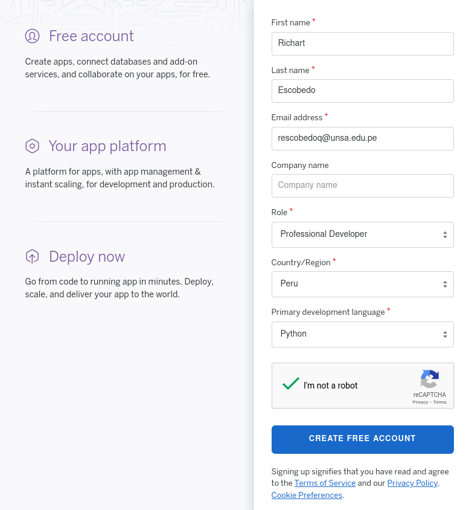

<div align="center">
<table>
    <theader>
        <tr>            
            <th>
                <span style="font-weight:bold;">Heroku
            </th>            
        </tr>
    </theader>
    
</table>
</div>

<div align="center">
<span style="font-weight:bold;">GUÍA DE LABORATORIO</span><br />
</div>

<table>
    <theader>
        <tr><th colspan="2">INFORMACIÓN BÁSICA</th></tr>
    </theader>
<tbody>

<tr><td>TÍTULO DE LA PRÁCTICA:</td><td>Heroku</td></tr>
<tr><td colspan="2">RECURSOS:
    <ul>
        <li>https://www.heroku.com/</li>
        <li>https://devcenter.heroku.com/articles/heroku-cli</li>
        <li>https://www.geeksforgeeks.org/how-to-deploy-a-basic-static-html-website-to-heroku/</li>
        <li>William S. Vincent - Django for Beginners 3.1-leanpub (2020)</li>
    </ul>
</td>
</<tr>
<tr><td colspan="2">INSTRUCTOR:
    <ul>
        <li>Richart Smith Escobedo Quispe  - richarteq@gmail.com</li>
    </ul>
</td>
</<tr>
</tdbody>
</table>

# Heroku

[![License][license]][license-file]
[![Downloads][downloads]][releases]
[![Last Commit][last-commit]][releases]

[![Debian][Debian]][debian-site]
[![Git][Git]][git-site]
[![GitHub][GitHub]][github-site]
[![Vim][Vim]][vim-site]


#

## OBJETIVOS Y TEMAS

### OBJETIVOS
-   Estudiar un framework MVC.
-   Crear de una WebApp simple.
-   Desplegar la  WebApp en Heroku.

### TEMAS
- 

## CONTENIDO DE LA GUÍA

### MARCO CONCEPTUAL

#### Heroku

-   Heroku es una plataforma (PaaS - Plataforma como servicio) para desplegar aplicaciones que van a estar disponible en la nube.

-   Crear una cuenta gratuita en Heroku
    -   Acceda a https://www.heroku.com/ y registrese.    
    
    -   Necesitará confirmar su incripción a través del correo electrónico.

#

#### Instalación - Inicio de sesión

-   Luego, instale en su sistema operativo el cliente de Heroku desde: https://devcenter.heroku.com/articles/heroku-cli

-   Para verificar que ya tiene el cliente de Heroku instalado ejecute desde una terminal:
    ```sh
    heroku --version
    ```
    ```sh
    heroku/7.60.1 linux-x64 node-v14.19.0
    ```

-   Inicie una sesión Heroku desde la consola:
    ```sh
    heroku login
    ```
    ```sh
    heroku: Press any key to open up the browser to login or q to exit:
    ```
    

    
    ```sh
    Opening browser to https://cli-auth.heroku.com/auth/cli/browser/...
    Logging in... done
    Logged in as rescobedoq@unsa.edu.pe
    ```
    

#

#### Desplegar una webapp sencilla en Heroku

-   Primero, crearemos un hola mundo en PHP y lo deplegaremos en una aplicación Heroku.

    -   Paso 01: Crear una nueva aplicación en el dashboard de heroku: https://dashboard.heroku.com/apps
        
        

    -   Paso 02: Crear un proyecto web básico en PHP .
        ```sh
        mkdir ejemplo-php-heroku
        cd ejemplo-php-heroku
        echo "<h1> Ejemplo PHP para Heroku </h1>" > home.html
        echo '<?php include_once("home.html"); ?>' > index.php
        echo '{}' > composer.json        
        ```
        ```sh
        tree .
        .
        ├── composer.json
        ├── home.html
        └── index.php
        ```
    -   Paso 03: Desplegar la WebApp en la aplicación Heroku. Para esto debes ubicarte en el ROOT de tu aplicación.
        ```sh
        heroku login
        git init        
        ```
        ```sh
        Inicializado repositorio Git vacío en /home/richart/.../ejemplo-php-heroku/.git/
        ```
        ```sh
        heroku git:remote -a ejemplo-php-heroku-pw2
        ```
        ```sh
        set git remote heroku to https://git.heroku.com/ejemplo-php-heroku-pw2.git
        ```
        ```sh
        git add .
        git commit -am "make it better"
        git push heroku main:master
        ```
        ```sh
        Enumerando objetos: 5, listo.
        Contando objetos: 100% (5/5), listo.
        Compresión delta usando hasta 12 hilos
        Comprimiendo objetos: 100% (2/2), listo.
        Escribiendo objetos: 100% (5/5), 390 bytes | 390.00 KiB/s, listo.
        Total 5 (delta 0), reusado 0 (delta 0), pack-reusado 0
        remote: Compressing source files... done.
        remote: Building source:
        remote: 
        remote: -----> Building on the Heroku-20 stack
        remote: -----> Determining which buildpack to use for this app
        remote: -----> PHP app detected
        remote: -----> Bootstrapping...
        remote: -----> Preparing platform package installation...
        remote:        NOTICE: No runtime required in composer.lock; using PHP ^7.3.0 | ^8.0.0
        remote: -----> Installing platform packages...
        remote:        - apache (2.4.54)
        remote:        - php (8.1.8)
        remote:        - composer (2.2.16)
        remote:        - nginx (1.22.0)
        remote: -----> Installing dependencies...
        remote:        Composer version 2.2.16 2022-07-05 16:50:29
        remote: -----> Preparing runtime environment...
        remote:        NOTICE: No Procfile, using 'web: heroku-php-apache2'.
        remote: -----> Checking for additional extensions to install...
        remote: -----> Discovering process types
        remote:        Procfile declares types -> web
        remote: 
        remote: -----> Compressing...
        remote:        Done: 15.5M
        remote: -----> Launching...
        remote:        Released v3
        remote:        https://ejemplo-php-heroku-pw2.herokuapp.com/ deployed to Heroku
        remote: 
        remote: This app is using the Heroku-20 stack, however a newer stack is available.
        remote: To upgrade to Heroku-22, see:
        remote: https://devcenter.heroku.com/articles/upgrading-to-the-latest-stack
        remote: 
        remote: Verifying deploy... done.
        To https://git.heroku.com/ejemplo-php-heroku-pw2.git
        * [new branch]      main -> master
        ```
    -   Ya deberiamos tener la aplicación web deployada: https://ejemplo-php-heroku-pw2.herokuapp.com/ 


## EJERCICIOS PROPUESTOS

1.  Desplique en Heroku un hola mundo en Django.

2.  En el framework para desarrollo de aplicaciones web que esta estudiando. 
    -   Cree los CRUDS para modelo de su proyecto.  
    -   Personalize sus plantillas.
    -   Y publíque su WebApp en la plataforma Heroku.


## REFERENCIAS
    -   https://www.heroku.com/
    -   https://devcenter.heroku.com/articles/heroku-cli
    -   https://www.geeksforgeeks.org/how-to-deploy-a-basic-static-html-website-to-heroku/
    -   William S. Vincent - Django for Beginners 3.1-leanpub (2020)

#

[license]: https://img.shields.io/github/license/rescobedoulasalle/git_github?label=rescobedoulasalle
[license-file]: https://github.com/rescobedoulasalle/git_github/blob/main/LICENSE

[downloads]: https://img.shields.io/github/downloads/rescobedoulasalle/git_github/total?label=Downloads
[releases]: https://github.com/rescobedoulasalle/git_github/releases/

[last-commit]: https://img.shields.io/github/last-commit/rescobedoulasalle/git_github?label=Last%20Commit

[Debian]: https://img.shields.io/badge/Debian-D70A53?style=for-the-badge&logo=debian&logoColor=white
[debian-site]: https://www.debian.org/index.es.html

[Git]: https://img.shields.io/badge/git-%23F05033.svg?style=for-the-badge&logo=git&logoColor=white
[git-site]: https://git-scm.com/

[GitHub]: https://img.shields.io/badge/github-%23121011.svg?style=for-the-badge&logo=github&logoColor=white
[github-site]: https://github.com/

[Vim]: https://img.shields.io/badge/VIM-%2311AB00.svg?style=for-the-badge&logo=vim&logoColor=white
[vim-site]: https://www.vim.org/


[![Debian][Debian]][debian-site]
[![Git][Git]][git-site]
[![GitHub][GitHub]][github-site]
[![Vim][Vim]][vim-site]


[![License][license]][license-file]
[![Downloads][downloads]][releases]
[![Last Commit][last-commit]][releases]